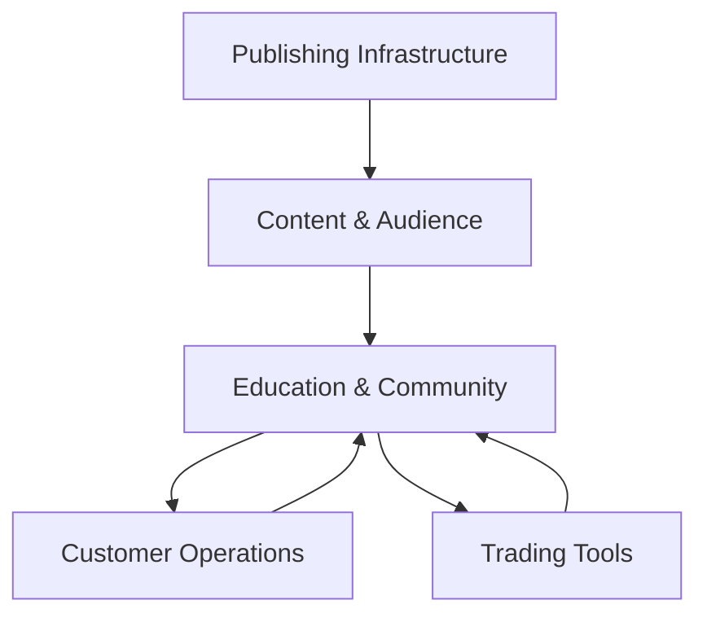

# Ecosystem Overview

SINA OS is structured around five connected layers.

## 1. Audience and Content

Educational videos, podcasts, live sessions and social-media content introduce traders to the ecosystem.

## 2. Education and Community

Students and traders enter free education, structured programs, mentorship or private communities according to their needs.

## 3. Customer Operations

SIA coordinates lead information, customer records, follow-ups, sales, payments, subscriptions and administrative workflows.

## 4. Trading Tools

Products such as the Trading Journal help traders document decisions, measure performance and identify behavioral patterns.

## 5. Content Infrastructure

The Content Distribution System and Instagram Automation support controlled publishing and audience interaction across selected platforms.

## Public Ecosystem Map

## Design Principle

Each system can operate independently, but together they create a connected operational ecosystem.
